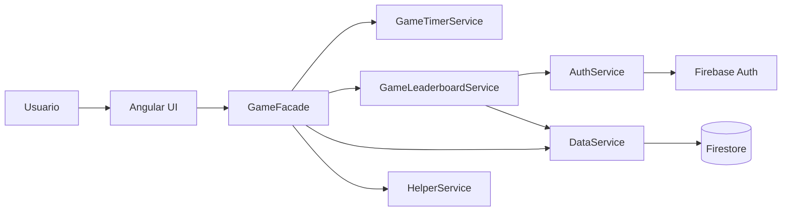
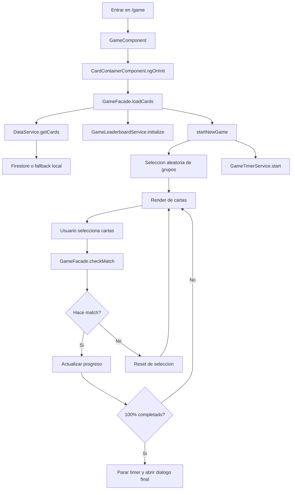
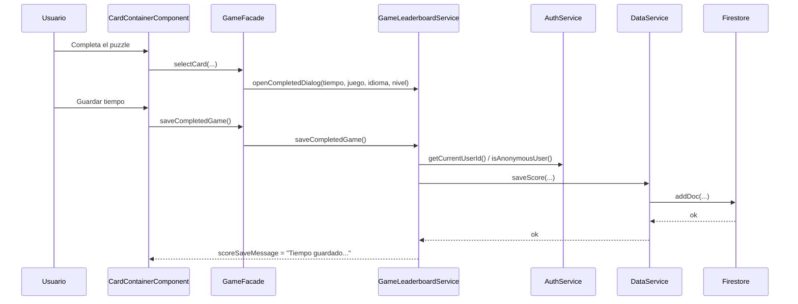
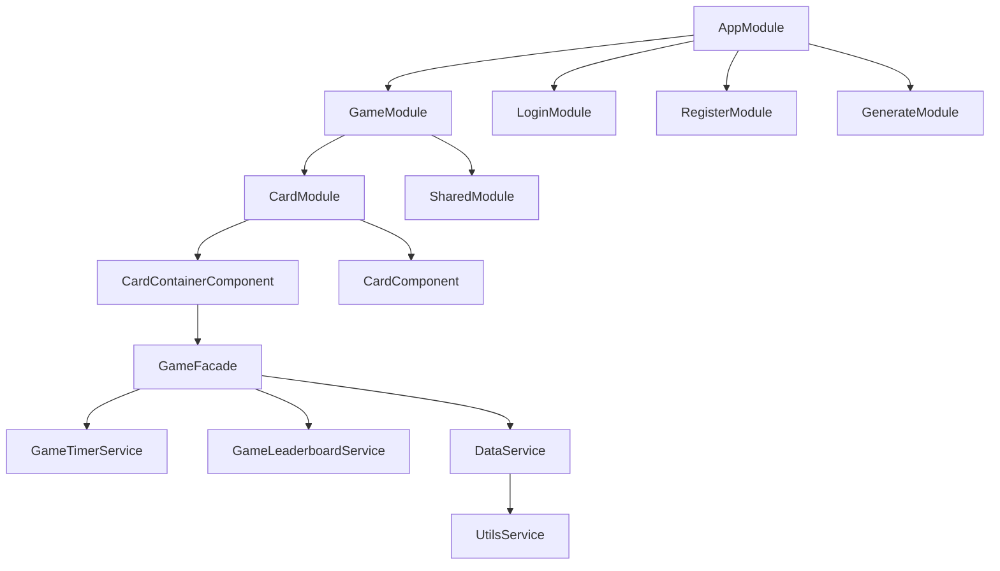

# Arquitectura de la aplicacion

## Resumen

La aplicacion es un juego de emparejar cartas construido con Angular. Desde mayo de 2026 soporta varios juegos dentro de la misma web:
- `Idiomas`
- `Sinonimos`
- `Antonimos`

Todos comparten la misma mecanica base de tablero, temporizador y ranking, pero no necesariamente la misma estructura de datos en Firestore.

Firebase se usa para:
- autenticacion
- lectura de cartas
- almacenamiento del ranking

## Vista general

## Capas principales

### 1. Presentacion

- `GameComponent` monta la pantalla del juego.
- `CardContainerComponent` compone cabecera, selector de juego, selector de nivel, tablero, dialogos y acciones.
- `CardComponent` renderiza una carta individual.

La UI consume estado expuesto por `GameFacade` y emite eventos como:
- seleccionar juego
- cambiar idioma
- cambiar dificultad
- seleccionar carta
- reiniciar partida
- guardar tiempo

### 2. Coordinacion del dominio

`GameFacade` es el punto de entrada de la pantalla. Orquesta:
- preferencias en `localStorage`
- carga de cartas para el juego actual
- seleccion y emparejamiento de cartas
- progreso
- temporizador
- ranking

### 3. Servicios especializados

- `GameTimerService`: cuenta atras y expiracion
- `GameLeaderboardService`: carga y guardado de tiempos
- `DataService`: acceso a Firestore y fallbacks
- `AuthService`: login, usuario actual e invitado
- `UtilsService`: construccion del mazo jugable a partir de pares persistidos

## Flujo de una partida

## Variantes de juego

### `Idiomas`

Modelo persistido:
- un documento contiene una palabra en castellano y sus traducciones

Modelo jugable:
- por cada par seleccionado se generan 2 cartas visibles en tablero:
  - `es`
  - idioma objetivo elegido por el usuario (`gb`, `it`, `pt`, `de`)

Persistencia:
- colecciones legacy por nivel: `easy`, `medium`, `hard`

### `Sinonimos`

Modelo persistido:
- documento binario con `left` y `right`

Modelo jugable:
- dos cartas por grupo
- ambas en castellano

Persistencia:
- `games/synonyms/levels/{level}/cards`

### `Antonimos`

Modelo persistido:
- documento binario con `left` y `right`

Modelo jugable:
- dos cartas por grupo
- ambas en castellano

Persistencia:
- `games/antonyms/levels/{level}/cards`

## Responsabilidades por servicio

### `GameFacade`

Archivo: [src/app/modules/card/services/game-facade.service.ts](/Users/javiergarcia/git/cards/src/app/modules/card/services/game-facade.service.ts:1)

Responsabilidades:
- leer preferencias guardadas
- exponer el juego actual, idioma, nivel y opciones disponibles
- pedir cartas al `DataService`
- transformar la partida cargada en un tablero aleatorio
- coordinar temporizador y ranking
- aplicar las reglas de seleccion y match

### `GameTimerService`

Archivo: [src/app/modules/card/services/game-timer.service.ts](/Users/javiergarcia/git/cards/src/app/modules/card/services/game-timer.service.ts:1)

Responsabilidades:
- iniciar cuenta atras
- exponer `timeLeft`
- detener el temporizador
- ejecutar callback al agotarse el tiempo

### `GameLeaderboardService`

Archivo: [src/app/modules/card/services/game-leaderboard.service.ts](/Users/javiergarcia/git/cards/src/app/modules/card/services/game-leaderboard.service.ts:1)

Responsabilidades:
- cargar mejores tiempos por juego, idioma y nivel
- abrir/cerrar el dialogo final
- guardar puntuacion del usuario
- exponer mensajes y estado de guardado

### `DataService`

Archivo: [src/app/services/data.service.ts](/Users/javiergarcia/git/cards/src/app/services/data.service.ts:1)

Responsabilidades:
- resolver la coleccion adecuada segun juego y dificultad
- leer cartas desde Firestore
- construir el mazo jugable con `UtilsService`
- hacer fallback local si Firestore no esta disponible
- leer y guardar rankings

### `UtilsService`

Archivo: [src/app/utils/utils.service.ts](/Users/javiergarcia/git/cards/src/app/utils/utils.service.ts:1)

Responsabilidades:
- generar cartas para `Idiomas`
- generar cartas para juegos binarios como `Sinonimos` y `Antonimos`
- asignar `groupId`, `pairs`, `voice` y estructura inicial del tablero

## Flujo de guardado de puntuacion

## Estructura de datos en Firebase

### Cartas

- `easy/`, `medium/`, `hard/`
  - schema de `Idiomas`: `icon`, `es`, `gb`, `it`, `pt`, `de`
- `games/synonyms/levels/{level}/cards`
  - schema: `icon`, `left`, `right`
- `games/antonyms/levels/{level}/cards`
  - schema: `icon`, `left`, `right`

### Ranking

- `leaderboards/{language}/levels/{level}/times`
  - ranking legacy para `Idiomas`
- `leaderboardsByGame/{gameId}/languages/{language}/levels/{level}/times`
  - ranking para juegos multi-juego

Campos de score:
- `gameId`
- `playerName`
- `durationSeconds`
- `language`
- `level`
- `createdAt`
- `userId`
- `isAnonymous`

### Configuracion

- `config/openaiCredentials`

## Diagrama de modulos frontend

## Decisiones de arquitectura

### Multi-juego con compatibilidad hacia atras

Se ha mantenido `Idiomas` sobre sus colecciones legacy para no romper datos existentes, mientras que los juegos nuevos viven bajo `games/{gameId}/...`.

### Facade como punto de entrada

La vista no conoce detalles de Firebase, temporizador, ranking o semillas de datos. Todo pasa por `GameFacade`.

### Dos formas de construir el mazo

`UtilsService` separa:
- generacion de cartas por idioma
- generacion de cartas binarias

Esto permite reutilizar la mecanica del tablero sin acoplarla al tipo de contenido.

### Ranking separado por juego

Los tiempos de `Idiomas`, `Sinonimos` y `Antonimos` no se mezclan. Esto evita comparativas inconsistentes entre mecanicas o vocabularios distintos.

## Mejoras futuras

- permitir iconos reales en `Sinonimos` y `Antonimos`
- añadir mas juegos binarios reutilizando la misma estructura
- mover seeds a JSON externos si el catalogo sigue creciendo
- unificar completamente la persistencia de `Idiomas` en `games/languages/...` cuando deje de hacer falta compatibilidad legacy
