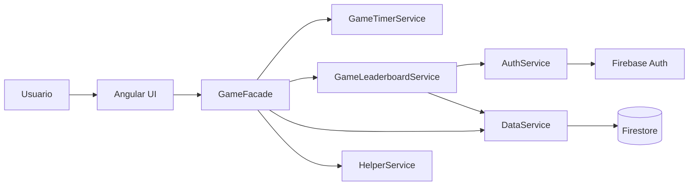
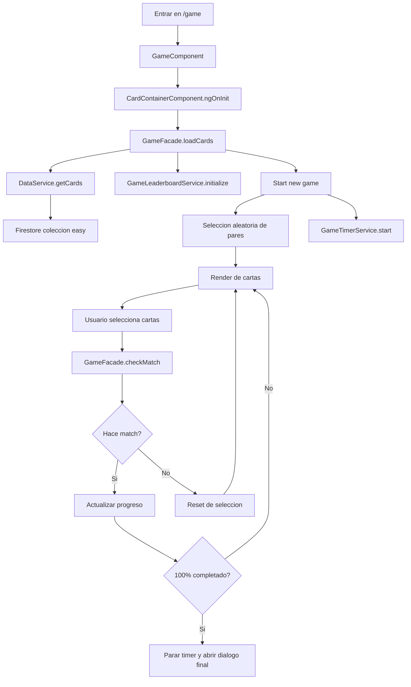
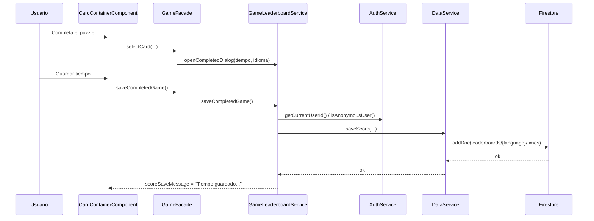
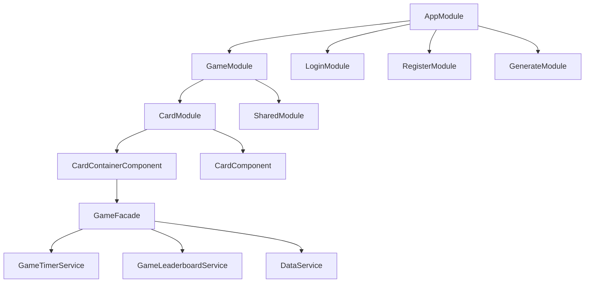

# Arquitectura de la aplicacion

## Resumen
La aplicacion es un juego de emparejar cartas construido con Angular. La UI vive en componentes de pagina y de modulo, mientras que la logica del juego se concentra en una capa `Facade` y servicios especializados. Firebase se usa para autenticacion, lectura de cartas y almacenamiento del ranking de tiempos.

## Vista general

## Capas principales

### 1. Capa de presentacion
- `GameComponent` monta la pantalla del juego.
- `CardContainerComponent` compone la cabecera, tablero, dialogos y acciones de usuario.
- `CardComponent` renderiza cada carta individual.

La presentacion consume estado expuesto por `GameFacade` y delega eventos como:
- seleccionar carta
- cambiar idioma
- iniciar nueva partida
- guardar puntuacion
- abrir ranking

## Flujo de una partida

## Responsabilidades por servicio

### `GameFacade`
Archivo: [src/app/modules/card/services/game-facade.service.ts](/Users/javiergarcia/git/cards/src/app/modules/card/services/game-facade.service.ts:1)

Es la capa de coordinacion entre UI y dominio del juego.

Responsabilidades:
- cargar cartas y preferencias
- mantener el estado reactivo principal del tablero
- gestionar seleccion de cartas y matches
- reconstruir el layout del tablero segun idioma y columnas
- coordinar temporizador y ranking

No accede directamente a Firebase Auth ni maneja internamente el timer.

### `GameTimerService`
Archivo: [src/app/modules/card/services/game-timer.service.ts](/Users/javiergarcia/git/cards/src/app/modules/card/services/game-timer.service.ts:1)

Responsabilidades:
- iniciar una cuenta atras
- exponer `timeLeft` como signal
- detener el temporizador
- ejecutar callback al finalizar el tiempo

### `GameLeaderboardService`
Archivo: [src/app/modules/card/services/game-leaderboard.service.ts](/Users/javiergarcia/git/cards/src/app/modules/card/services/game-leaderboard.service.ts:1)

Responsabilidades:
- cargar mejores tiempos por idioma
- abrir/cerrar el dialogo de fin de partida
- preparar nombre por defecto
- guardar la puntuacion del usuario
- exponer el estado del ranking a la UI

### `DataService`
Archivo: [src/app/services/data.service.ts](/Users/javiergarcia/git/cards/src/app/services/data.service.ts:1)

Responsabilidades:
- leer cartas desde Firestore
- usar fallback local si Firebase no esta disponible
- leer top scores del ranking
- guardar nuevas puntuaciones

### `AuthService`
Archivo: [src/app/services/auth.service.ts](/Users/javiergarcia/git/cards/src/app/services/auth.service.ts:1)

Responsabilidades:
- login con Google, email/password o invitado
- persistencia de sesion
- exponer `username`
- facilitar `uid` y si el usuario es anonimo

## Flujo de guardado de puntuacion

## Estructura de datos en Firebase

### Firestore
- `easy/`
  - documentos con pares de cartas: `icon`, `es`, `gb`, `it`, `pt`, `de`
- `prueba/`
  - misma estructura que `easy`
- `leaderboards/{language}/times/`
  - `playerName`
  - `durationSeconds`
  - `language`
  - `createdAt`
  - `userId`
  - `isAnonymous`
- `config/openaiCredentials`
  - credenciales auxiliares si se usan desde la pagina `/generate`

## Diagrama de modulos frontend

## Decisiones de arquitectura

### Signals para estado de UI
Se usan `signal()` de Angular para exponer estado ligero y reactivo sin sobrecargar la app con mas infraestructura.

### Facade como punto de entrada de la pantalla
La vista no conoce detalles de Firebase, temporizador o persistencia. Todo pasa por `GameFacade`, lo que simplifica componentes y testing.

### Separacion por responsabilidad
La logica que tiende a crecer de forma independiente se ha sacado a servicios propios:
- timer
- leaderboard

Esto reduce el tamaño del `Facade` y prepara mejor la app para nuevas funcionalidades.

## Posibles mejoras futuras
- extraer un `GameEngineService` para encapsular toda la logica de emparejamiento y barajado
- añadir pruebas de integracion para el flujo completo de partida
- versionar y limitar el ranking por dificultad, idioma o modo de juego
- registrar eventos analiticos de inicio, fin y abandono de partida
